## Introduction

English | [Simplified Chinese](README_zh-CN.md)

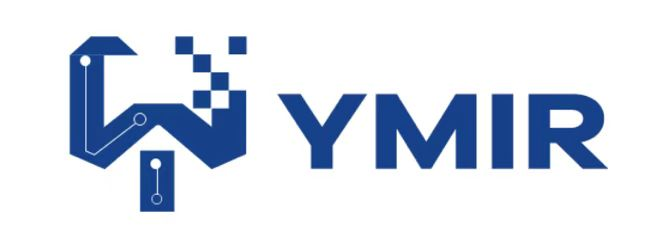

<!-- START doctoc generated TOC please keep comment here to allow auto update -->
<!-- DON'T EDIT THIS SECTION, INSTEAD RE-RUN doctoc TO UPDATE -->
**Catalog**

- [1. Introduction to AI SUITE-YMIR](#1-introduction-to-ai-suite-ymir)
  - [1.1. Main functions](#11-main-functions)
  - [1.2. Apply for trial](#12-apply-for-trial)
- [2. Installation](#2-installation)
  - [2.1. Environment dependencies](#21-environment-dependencies)
  - [2.2. Installing YMIR-GUI](#22-installing-ymir-gui)
  - [2.3. Installing Label Studio (optional)](#23-installing-label-studio-optional)
- [3. Use YMIR-GUI](#3-use-ymir-gui)
  - [3.1. Raw Data Preparation](#31-raw-data-preparation)
  - [3.2. Data Labeling](#32-data-labeling)
  - [3.3. Model Training](#33-model-training)
  - [Model iterations (Improve accuracy through iteration)](#model-iterationsimprove-accuracy-through-iteration)
  - [3.4. Data mining](#34-data-mining)
  - [3.5. Model Iteration](#35-model-iteration)
  - [3.6. Model Validation](#36-model-validation)
  - [3.7. Model Download](#37-model-download)
- [4. For advanced users: YMIR-CMD (command line) User's Guide](#4-for-advanced-users-ymir-cmd-command-line-users-guide)
  - [4.1 Installation](#41-installation)
  - [4.2 Typical Model Production Process](#42-typical-model-production-process)
    - [4.2.1 Preparation of External Data](#421-preparation-of-external-data)
    - [4.2.2 Create local repo and import data](#422-create-local-repo-and-import-data)
    - [4.2.3 Merge and filter](#423-merge-and-filter)
    - [4.2.4 Train the first model](#424-train-the-first-model)
    - [4.2.5 Data Mining](#425-data-mining)
    - [4.2.6 Data Labeling](#426-data-labeling)
    - [4.2.7 Model Iteration-Data Merging](#427-model-iteration-data-merging)
    - [4.2.8 Model Iteration-Model Training](#428-model-iteration-model-training)
  - [4.3. YMIR-CMD Manual](#43-ymir-cmd-manual)
- [5. Get the Code](#5-get-the-code)
  - [5.1. YMIR repos](#51-ymir-repos)
  - [5.2. Code Contribution](#52-code-contribution)
- [6. Design Concept](#6-design-concept)
  - [6.1. Life of a dataset](#61-life-of-a-dataset)
    - [6.1.1. Introduction to a dataset](#611-introduction-to-a-dataset)
    - [6.1.2. Branch and Dataset Management](#612-branch-and-dataset-management)
- [7. MISC](#7-misc)
  - [7.1. FAQ](#71-faq)
  - [7.2. License](#72-license)
  - [7.3. Contact us](#73-contact-us)

<!-- END doctoc generated TOC please keep comment here to allow auto update -->

# 1. Introduction to AI SUITE-YMIR

YMIR is a streamlined model development product focused on dataset versioning and model iterations in the AI SUITE open-source series.

AI commercialization is currently reaching a stage of maturity in terms of computing power, algorithms, and technology. In real business AI developments often encounter bottlenecks in the production process such as lack of skilled developers, high development costs and long iteration cycles.

YMIR provides an end-to-end algorithm development system to reduce the cost of enterprises using artificial intelligence technology and accelerate the adoption of artificial intelligence. The platform provides ML developers with a one-stop service for data processing, model training, and other steps required in the AI development cycle.

The YMIR platform provides efficient model development capabilities in a data-centric approach. The platform integrates active learning methods, data, and model version control as well as concepts such as workspaces to enable rapid iteration of multiple task-specific datasets and projects in parallel. The platform is designed with open APIs so that third party tools can also be integrated into the system.

## 1.1. Main functions

A typical model development process can usually be summarized in a few steps: defining the task, preparing the data, training the model, evaluating the model, and deploying the model.

*  Define the task: Before starting an AI development project, it is important to be clear about what is to be analyzed? What is the expected input and output? This will help developers correctly convert the problem into several typical ML modeling tasks, such as image classification, object detection, etc. Different tasks have different data requirements and use different AI development tools.

*  Prepare data: Data preparation is primarily the process of collecting and pre-processing data. It is the foundation of a successful AI development project.  The most important task in this step is to ensure the quality of data and annotations. In many projects, it is impossible to collect all the required data at the beginning. Therefore, the project developer may find that some data is still missing in the subsequent stages, and the data set still needs to be adjusted and updated repeatedly.

*  Training models: Commonly known as "modeling". This step refers to the exploration and analysis of prepared data to discover the internal patterns and any links between the input and the expected prediction target.  The result of this step is usually one or more machine learning models. These models can be applied to new data to obtain predictions. A large number of developers train their own business models based on mainstream model training frameworks.

*  Evaluation of the model: After training the model, the entire development process has not yet been completed. Models need to be evaluated and checked before being put into production. Normally, you will not get a production quality model all at once. You need to adjust parameters, add new training data, and continuously iterate to evaluate the generated model. Some common metrics can help you evaluate models quantitatively and pick a satisfactory model.

*  Deployment of models: Models are developed and trained based on previously available data (possibly test data). After a satisfactory model is obtained, it will be applied to real data to make predictions at scale.

The YMIR platform mainly meets the needs of users for developing models at scale. The platform provides users with an easy-to-use user interface which is convenient for data management and inspection. The user interface is divided into four parts: home page, task management, dataset management and model management, which have the following main functions.

| Function Module    | Primary Function   | Secondary Function                                           | Function Description                                         |
| ------------------ | ------------------ | ------------------------------------------------------------ | ------------------------------------------------------------ |
| Data Management    | Dataset Management | Importing Datasets                                           | Support users to import prepared datasets by copying public datasets, URL address, path import and local import |
| Dataset Management | View Datasets      | Supports visualization of image data and annotations, and viewing of historical information |                                                              |
| Dataset Management | Edit Dataset       | Support Dataset Edit, Delete                                 |                                                              |
| Task Management    | Filtering Tasks    | Support for filtering datasets by tags                       |                                                              |
| Training Models    | Task Management    | Training Tasks                                               | Support self-selected datasets, labels, and adjust training parameters to train models according to needs, and view the corresponding model results after completion |
| Model Validation   | Model Management   | Model Validation                                             | Support for uploading a single image to check the accuracy of a model |
| Data Mining        | Task Management    | Mining Tasks                                                 | Support for finding the most beneficial data for model optimization in massive datasets |
| Data Annotation    | Task Management    | Annotation Tasks                                             | Support for adding annotations to image data                 |

## 1.2. Apply for trial

We provide an online trial version for your convenience. If you need, please fill out the [Apply for YMIR Trial](https://alfrat.wufoo.com/forms/mkxsic906al0pf/) , and we will send the trial information to your email address.

# 2. Installation

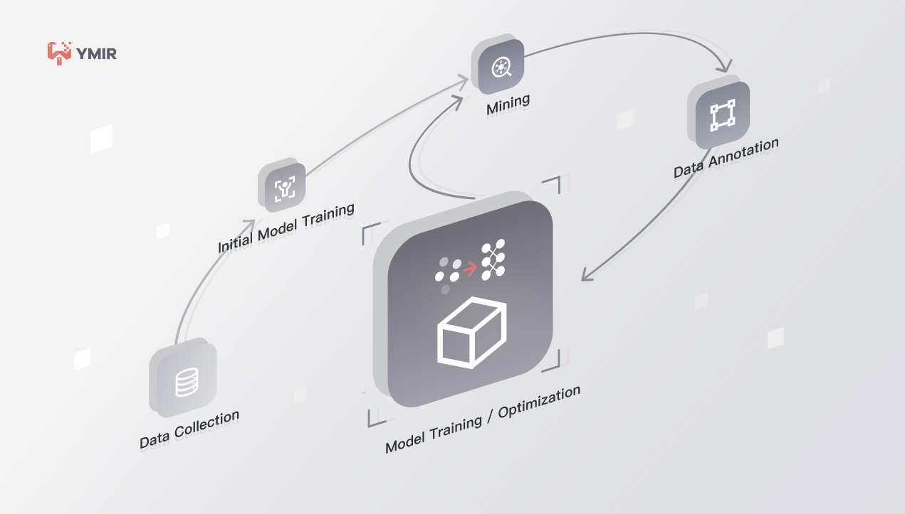

How do users choose to install GUI or CMD:

1. We recommend most users to install the GUI version, which has full support of model training and optimization processes;

2. If you need to modify the default configuration of the system, such as customizing labels and replacing training algorithms, it is recommended to install CMD;

This chapter is the installation instructions of YMIR-GUI. If you need to use CMD  please refer to [Ymir-CMD line user guide] (#4-for-advanced-users-ymir-cmd-command-line-users-guide).

## 2.1. Environment dependencies

1. NVIDIA drivers shall be properly installed before installing YMIR. See https://www.nvidia.cn/geforce/drivers/ for detailed instructions.

2.Installing docker:

*  How to install Docker & Docker Compose  https://docs.docker.com/get-docker/
*  How to install NVIDIA Docker  https://github.com/NVIDIA/nvidia-docker

3.Recommended hardware.

*  NVIDIA GeForce RTX 2080 Ti or better.

## 2.2. Installing YMIR-GUI

The user must ensure that all the conditions in [Environment Dependence] (#21-environment-dependencies) have been met before deploying, otherwise the installation may fail.

The YMIR-GUI project package is on DockerHub and the steps to install and deploy YMIR are here as follows:

1.  Clone the deployment project YMIR to the local server:

  ```sh
  git clone git@github.com:IndustryEssentials/ymir.git
  ```

2. In the cloned YMIR folder, install and start the service by typing:

  ```sh
  sh ymir.sh start
  ```

After the service is started successfully, YMIR will be available at [http://localhost:12001/](http://localhost:12001/). If you need to **stop the service**, run the command: `sh ymir.sh stop`

## 2.3. Installing Label Studio (optional)

Label Studio is an external labeling system that works with YMIR. Install it if you plan to label data in the development process.

1. In the ymir directory, start the install label studio command as follows:

  ```sh
docker-compose -f docker-compose-component.yml up -d
  ```

2. The command to check the status of the Label Studio after completion is as follows:

  ```sh
docker-compose -f docker-compose-component.yml ps
  ```

  User can log in to the default address [http://localhost:12007/](http://localhost:12007/). The installation is successful when the login interface is displayed.

3. Configure the label studio authorization token

  After the user registers and logs in to Label Studio, select "Account & Settings" in the upper right corner of the page, copy the Token value and paste it into the corresponding location (LABEL_STUDIO_TOKEN) in the .env configuration file of the ymir project. An example is as follows:

  ```sh
  label studio env

  LABEL_STUDIO_OPEN_HOST=http://xxx.xxx.xx.xxx

  LABEL_STUDIO_OPEN_PORT=12007

  LABEL_STUDIO_TOKEN="Token token_value"

  LABEL_TASK_LOOP_SECONDS=60
  ```

  Restart ymir after configuring the host address (LABEL_STUDIO_OPEN_HOST) and token value (LABEL_STUDIO_TOKEN).

4. The command to stop the label studio service is:

  ```sh
docker-compose -f docker-compose-component.yml down
  ```

# 3. Use YMIR-GUI

This section uses a complete model iteration process as an example to illustrate how to use the YMIR platform.


As is shown in the figure above, YMIR divides a model development process into several steps, and details of how to run each step is listed in the subsequent sub-sections.

## 3.1. Raw Data Preparation

The user prepares a dataset with training targets (training set, test set) for training an initial model.  Before importing, please ensure that the format of the dataset meets the following requirements:

*  The dataset is in .zip format, which contains two folders that need to be named images and annotations respectively;
*  Images: users need to create a picture folder and place pictures. The format currently supported by this platform is limited to jpg, jpeg, png.
*  annotations: create annotations folder and put it in annotation files formatted as pascal VOC (when there is no annotation file, leave the folder empty);
*  For the dataset with annotated files, the annotated object type must belong to the built-in tag list of the platform. Please click the link to view the detailed tag list, [Tag List](https://github.com/IndustryEssentials/ymir-proto/blob/master/ymir/ids/type_id_names.csv) for details;
*  If users need to add custom tags, please see [How to modify the category name tag file](#71-faq).

The platform supports four kinds of dataset imports: public dataset replication, network import, local import and path import.

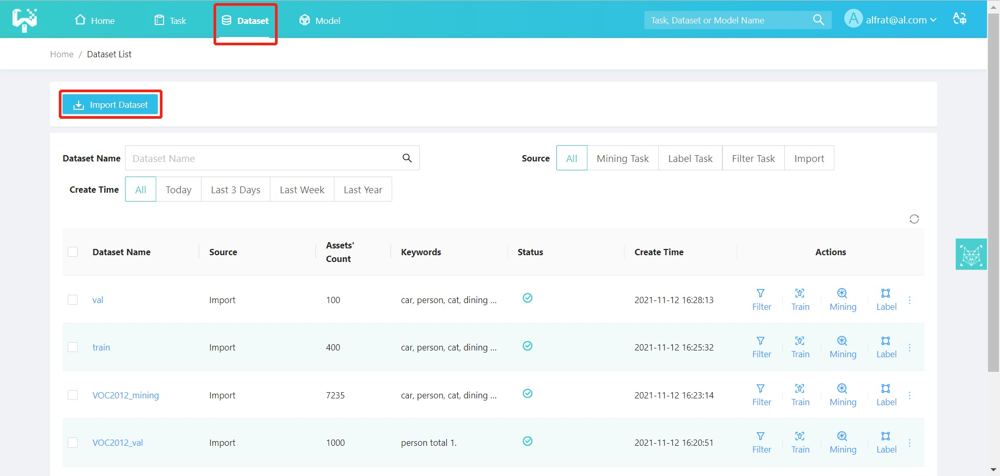

(1) Public dataset replication: user need import the built-in dataset of the super administrator, which is stored on the super administrator to the current operating user in the form of replication. The users can filter and import the label categories they need, as shown in the figure below:
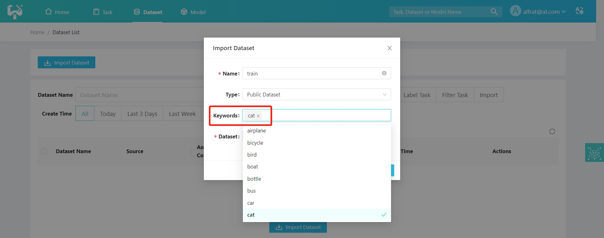

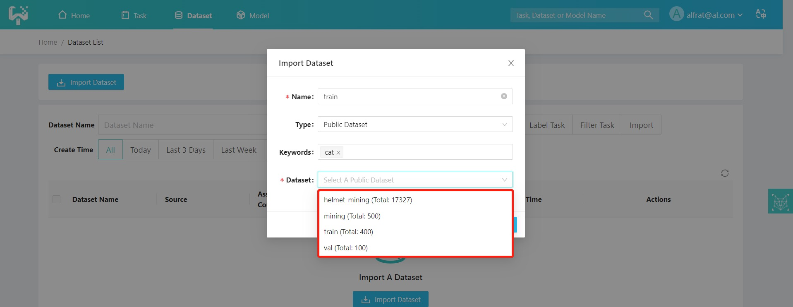

Select the eligible dataset and click [OK] to start copying.

(2) Network import: user need enter the URL path corresponding to the dataset as shown in follows:

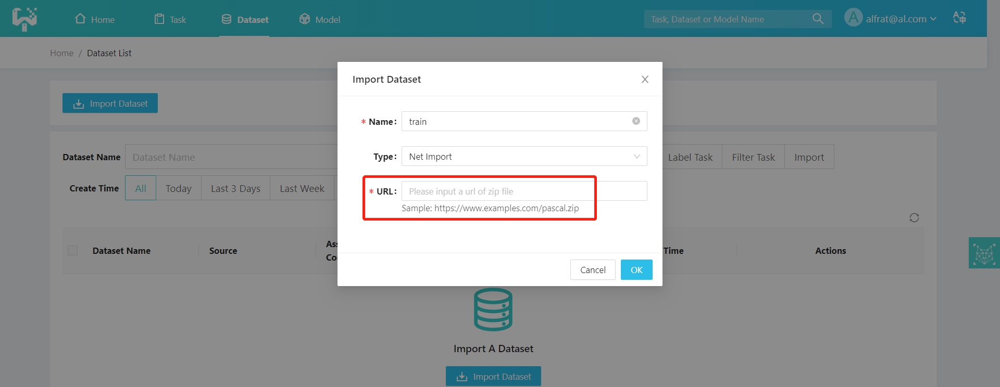

(3) Local import: user need upload a zip file of the local dataset in the following format. The zip size is recommended to be no more than 200MB.

Users can download the example **Sample.zip** for reference as follows:

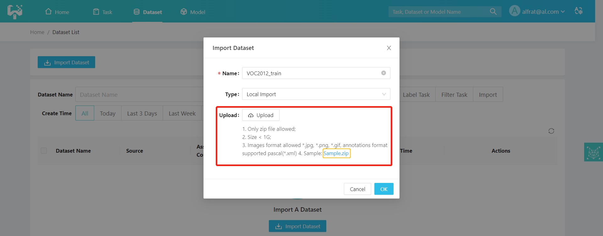

(4) Path Import: user need enter the absolute path of the dataset in the server, as shown in the figure below：

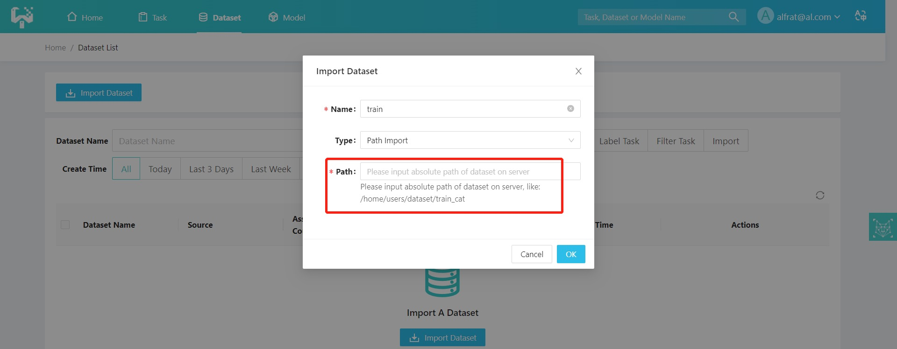

Users can download the open source dataset VOC2012 ([click to download VOC2012](http://host.robots.ox.ac.uk/pascal/VOC/voc2012/VOCtrainval_11-May-2012.tar)) from the web, unpacking and separating the training set (VOC2012_ train), the test set (VOC2012_val) and the dataset to be mined (VOC2012_mining). The user needs to modify the folder names, then compress them into separate zip packages that meet the import requirements and import them by local import. As the following figure show:

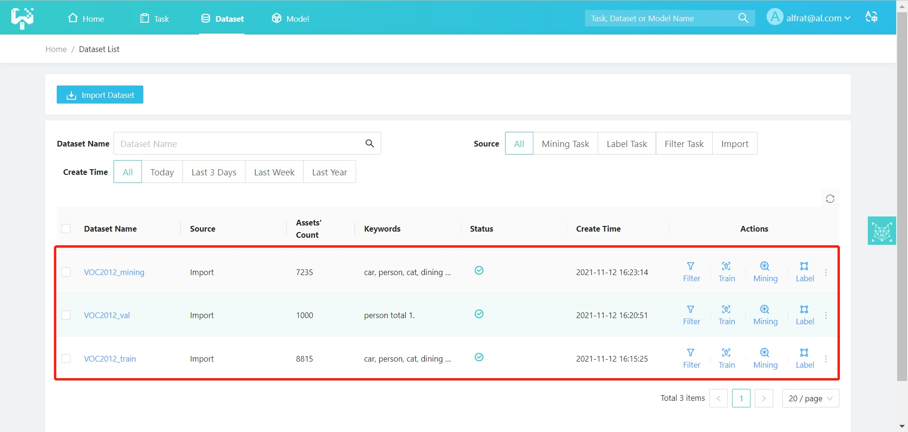

## 3.2. Data Labeling

If the imported training set or test set does not have labels, users need to label them. Click the [Label] button in the task management page to jump to the Create Data Annotation Task interface as shown in the following figure.

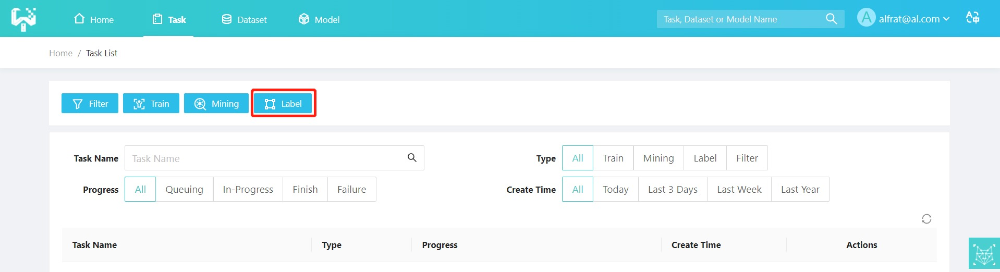

User need enter the task name (required), select the dataset (required), enter the labelor's email address (user need to register in advance with the labeling system in advance, click "Register Labeling Platform Account" at the bottom to jump to the Label Studio labeling platform to register your labeling account) and select the labeling target (person, car). If you want to check the labeling platform by yourself, please check "View on labeling platform" and fill in your labeling platform account (also need to register in advance). If you have more detailed requirements for the annotation, you can upload the annotation description document for the annotator's reference. Click Create Task, as shown in the figure below:


After successful creation, you can view the corresponding task progress and information on the task management interface. After the task is completed, the YMIR will automatically retrieve the annotation results and generate a new dataset with the new annotation.

## 3.3. Model Training

Click the [Train] button in the task management interface to jump to the Create Model Training Task interface, as shown in the following figure:

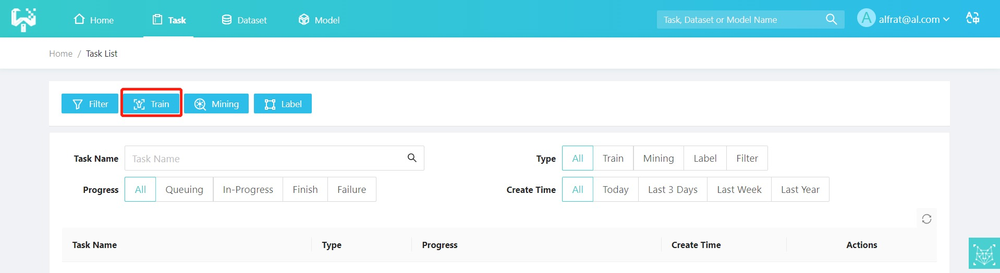

User need enter the needed information in the form above to configure a training task. The training parameters (a.k.a. hyper-parameters) are populated with default values and can be changed if necessary. If you want to add parameters, you can add them yourself. Then, click [Create Task]. As shown in the figure below, the initial model is trained.

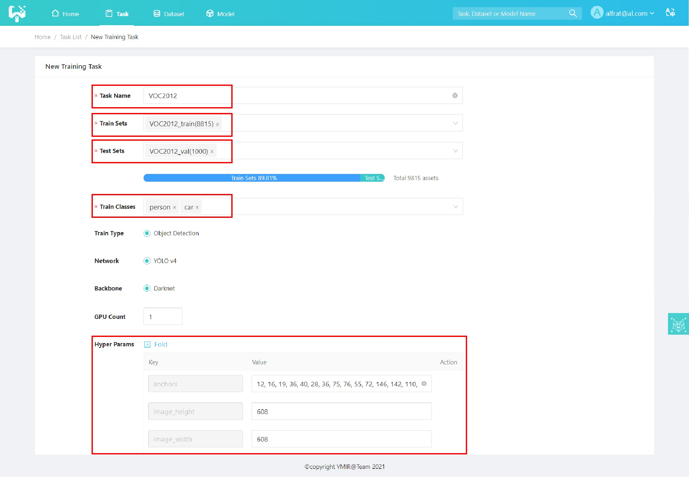

After successful creation, you can view the corresponding task progress and information in the task management page, and you can view the accuracy of the trained model (mAP value) after the task is completed.

## Model iterations (Improve accuracy through iteration)

## 3.4. Data mining

YMIR provides data mining algorithms that support million-level data mining to quickly find the most favorite data for model optimization.

User can use the model obtained from the initial training to perform data mining on the dataset to be mined. Click the [Mining] button on the task management interface to jump to the Create Data Mining Task interface, as shown in the following figure:

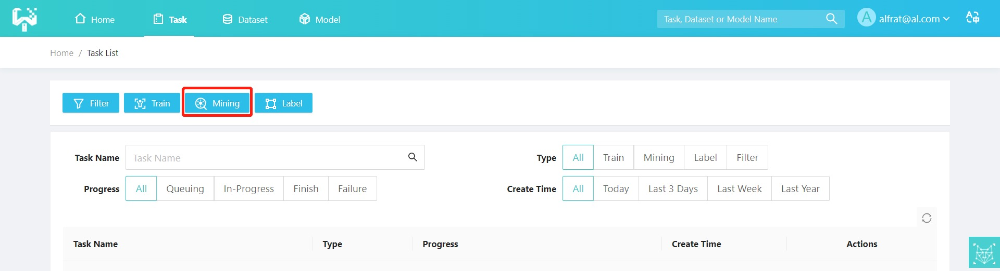

User need enter the task name (required), select the dataset (VOC2012_mining), select the model (the last trained initial model), enter the filter test TOPK=500 (the first 500 successfully mined images) and set custom parameters if necessary.

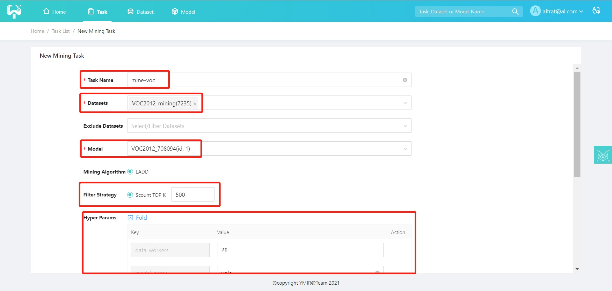

After the task is successfully created, the user can enter the task management page to view the corresponding task progress and view the result set after completing the mining task.

## 3.5. Model Iteration

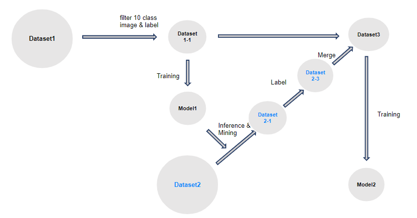

After the mining task is completed, the mined dataset (mine-voc, 500 images) is obtained from the dataset to be mined (VOC2012_mining), and the mined dataset (mine-voc, 500 sheets) is labeled by repeating step [3.2 Data labeling] (#32-data-labeling)to obtain the labeled dataset (mine-voc-label, 500 sheets). The following figure shows:

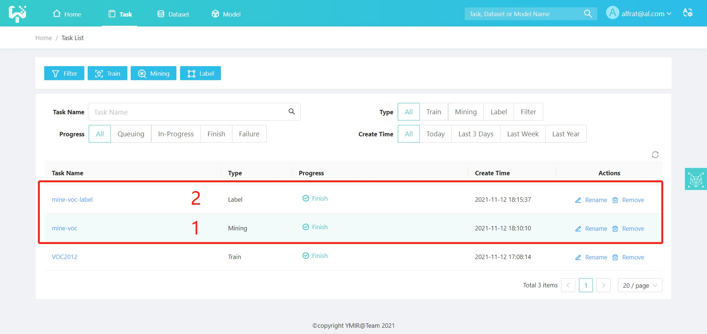

After the labeling is complete, the training task is created again and the labeled dataset (mine-voc-label, 500 sheets) is merged with the original dataset (VOC2012_train, 8815 sheets). The process of creating training is shown in the figure below:

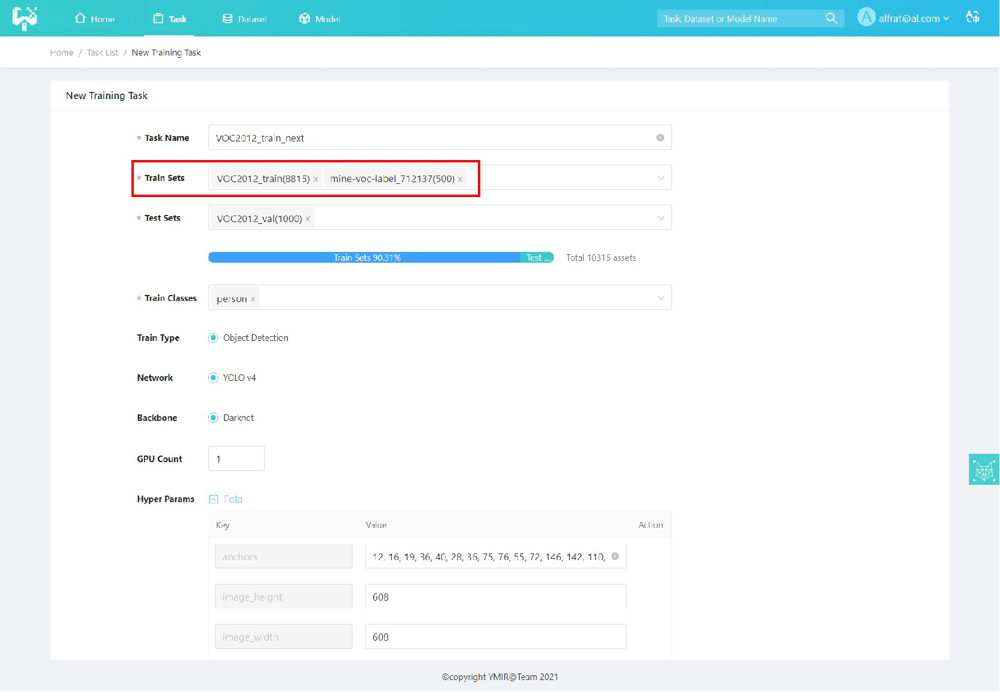

## 3.6. Model Validation

After a model is trained, user can validate the model results. On the [Model Management] page, you can click the [Verify] button of the corresponding model to jump to the [Model Validation] page, as shown in the following figure:

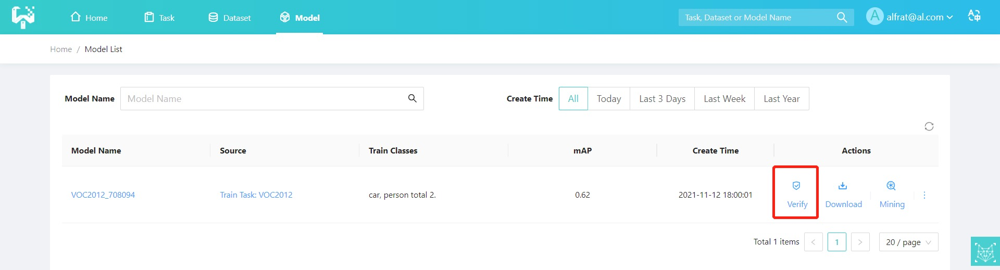

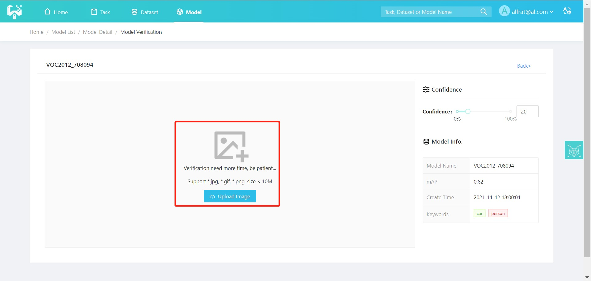

User can click the [Upload Image] button and select local image to upload, the result will be displayed as follows:

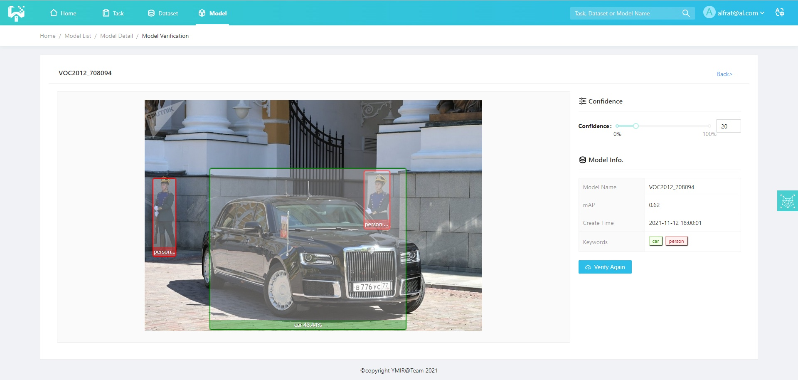

Users can choose to download the trained model or continue to use the model for mining, entering the next round of data mining - data labeling - model training cycle to further optimize the model.

## 3.7. Model Download

Users can click the [Download] button on the [Model List] page. The download file format is a tar package, which contains the network structure of the model, network weights, hyper-parameter configuration files, training environment parameters and results. As shown below:

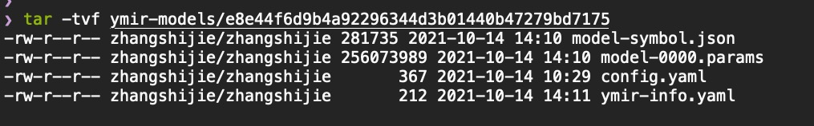

# 4. For advanced users: YMIR-CMD (command line) User's Guide

This chapter is the instructions of YMIR-CMD line. If you need to use GUI, please refer to [Ymir-GUI Installation] (#2-installation).

## 4.1 Installation

**Mode I.Install with pip**

```
# Requires >= Python3.7
$ pip install ymir-cmd
$ mir --vesion
```

**Model Ⅱ.Install from source**

```
$ git clone --recursive git@github.com:IndustryEssentials/ymir-cmd.git
$ cd ymir-cmd
$ python setup.py clean --all install
$ mir --version
```

## 4.2 Typical Model Production Process


The above figure shows a typical process of model training:  1)the user prepares external data;  2)imports it into the system; 3)filters the data appropriately; 4) starts training to get a model (possibly low accuracy) 5) based on this model, selects images in a dataset to be mined that are suitable for further training; 6)annotates these images; 7)merges the annotated results with the original training set; 8) uses the merged results to run the training process again to obtain a better model.
In this section, we need to implement the process shown above using the command line.
All the following commands are prefixed with $ (which is also the Linux prompt under the normal user), and when entering a command in the console, the user does not need to enter $ at the same time.

### 4.2.1 Preparation of External Data

The system has the following requirements for external data.

1. With [VOC format annotations]( https://towardsdatascience.com/coco-data-format-for-object-detection-a4c5eaf518c5).

2. The paths to all images (collectively referred to as assets or medias in this system) need to be written uniformly to the index.tsv file, and all annotation files need to be in the same directory.

3. User needs read permission of index.tsv, all images and all annotation files.

We take pascal 2017 test dataset for example.
Download the dataset VOC2012test.tar from the official website and unpack.

```
$ tar -xvf VOC2012test.tar
```

After unpacking, the following directory structure is available (assuming VOCdevkit is in the /data directory).

```
/data/VOCdevkit
` - VOC2012
    |-- Annotations
    |-- ImageSets
    |-- Action
    |-- Layout
    |-- Main
    | `-- Segmentation
    ` -- JPEGImages
```

Note that all annotations are in the annotations directory and all images are located in the JPEGImages directory.
Use the following command to generate the index.tsv file.

```
$ find /data/VOCdevkit/VOC2012/JPEGImages -type f > index.tsv
```

And index.tsv will be:

```
/data/VOCdevkit/VOC2012/JPEGImages/2009_001200.jpg
/data/VOCdevkit/VOC2012/JPEGImages/2009_004006.jpg
/data/VOCdevkit/VOC2012/JPEGImages/2008_006022.jpg
/data/VOCdevkit/VOC2012/JPEGImages/2008_006931.jpg
/data/VOCdevkit/VOC2012/JPEGImages/2009_003016.jpg
...
```

And this index.tsv can be used for the next step of data import.

In addition, each annotation in the Annotations folder has the same main file name as the image. One of the <name>xxx</name> attributes will be extracted as a predefined keyword to be used in a later step of data filtering.

### 4.2.2 Create local repo and import data

The command line on this system uses a similar approach to git for managing users' resources, where users create their own mir repository and do all their next tasks in this mir repo.

Use the following command to create mir repo:

```
$ mkdir ~/mir-demo-repo && cd ~/mir-demo-repo # Create the directory and enter
$ mir init # init this directory to a mir repo
$ mkdir ~/ymir-assets ~/ymir-models # Creates assets and models storage directory, mir repo only keeps reference to assets and models
```

User is required to prepare three data sets in advance.

1. Training set (named dataset-training for example), with annotations, for initial model training.

2. Validation set (named dataset-val), with annotations, for validation.

3. Mining set (named dataset-mining), a large dataset to be mined from.

User imports the three data sets with the following command.

```
$ cd ~/mir-demo-repo
$ mir import --index-file /path/to/training-dataset-index.tsv \ # index.tsv path
             --annotation-dir /path/to/training-dataset-annotation-dir \ # annotations dir
             --gen-dir ~/ymir-assets \ # assets storage dir
             --dataset-name 'dataset-training' \ # dataset name
             --dst-rev 'dataset-training@import' # destination branch and task name
$ mir checkout master
$ mir import --index-file /path/to/val-dataset-index.tsv \
             --annotation-dir /path/to/val-dataset-annotation-dir \
             --gen-dir ~/ymir-assets \
             --dataset-name 'dataset-val' \
             --dst-rev 'dataset-val@import'
$ mir checkout master
$ mir import --index-file /path/to/mining-dataset-index.tsv \
             --annotation-dir /path/to/mining-dataset-annotation-dir \
             --gen-dir ~/ymir-assets \
             --dataset-name 'dataset-mining' \
             --dst-rev 'dataset-mining@import'
```

Use this command to see branches of current mir repo:

```
$ mir branch
```

There are four branches: master, dataset-training, dataset-val, dataset-mining, and repo is now on branch dataset-mining.

Users can also view the status of branch with:

```
$ mir show --src-rev dataset-mining
```

And output as follow:

```
person;cat;car;airplane

metadatas.mir: 200 assets, tr: 0, va: 0, te: 0, unknown: 200
annotations.mir: hid: import, 113 assets
tasks.mir: hid: import
```

The first and the second line are predefined keywords and user-defined keywords, (in this output, no user-defined keyword), and the following lines are the number of resources under the current branch, the number of annotations, and the task status.

### 4.2.3 Merge and filter

User can merge dataset-training and dataset-val with:

```
$ mir merge --src-revs tr:dataset-training@import;va:dataset-val@import \ # source branches to be merged
            --dst-rev tr-va@merged \ # destination branch and task name
            -s host # conflicts resolve strategy: use infos on host branch (the first branch in --src-revs)
```

After the merge is complete, you can see that the current repo is under the tr-va branch and you can check the status with the mir show:

```
$ mir show --src-revs HEAD # HEAD refers to the current head branch, and can be replaced by the specific branch name tr-va
```

Output as follows:

```
person;cat;car;airplane

metadatas.mir: 3510 assets, tr: 2000, va: 1510, te: 0, unknown: 0
annotations.mir: hid: merged, 1515 assets
tasks.mir: hid: merged
```

If the dataset-training and dataset-val before the merge have 2000 and 1510 images, you can see that the merged branch has 2000 images as the training set and 1510 images as the validation set.
If user only want to train models for people and cats' detection, we first filter the resources for the presence of people or cats out from branch tr-va:

```
mir filter --src-revs tr-va@merged \
           --dst-rev tr-va@filtered \
           -p 'person;cat'
```

### 4.2.4 Train the first model

First, user need pull the training and mining docker images from dockerhub:

```
docker pull industryessentials/executor-det-yolov4-training:release-0.1.2
docker pull industryessentials/executor-det-yolov4-mining:release-0.1.2
```

and start the training process with the following command.

```
mir train -w /tmp/ymir/training/train-0 \
          --media-location ~/ymir-assets \ # assets storage dir
          --model-location ~/ymir-models \ # model storage dir
          --config-file ~/training-config.yaml \ # training config file, get it from training docker image
          --src-revs tr-va@filtered \
          --dst-rev training-0@trained \
          --executor industryessentials/executor-det-yolov4-training:release-0.1.2 # docker image name
```

After the model training is done the system will output the model id and the user can see the packaged file of this trained model in ~/ymir-models.

### 4.2.5 Data Mining

This model is trained on a small dataset, and we can get the best images for the next training step in this mining process with the following command:

```
mir mining --src-revs dataset-mining@import \ # mining dataset branch
           --dst-rev mining-0@mining \ # destination branch
           -w /tmp/ymir/mining/mining-0 \ # tmp working dir for this task
           --topk 200 \ # topk
           --model-location ~/ymir-models \
           --media-location ~/ymir-assets \
           --model-hash <hash> \ # model id
           --cache /tmp/ymir/cache \ # asset cache
           --config-file ~/mining-config.yaml \ # mining config file, get it from mining docker image
           --executor industryessentials/executor-det-yolov4-mining:release-0.1.2 # mining docker image name
```

### 4.2.6 Data Labeling

Now we have top 200 images best for the next training step saved on branch mining-0. The next task is to export these resources and send them to the annotators for labeling.
You can export assets with the following command.

```
mir export --asset-dir /tmp/ymir/export/export-0/assets \ # export directory for assets
           --annotation-dir /tmp/ymir/export/export-0/annotations \ # export directory for annotations
           --media-location ~/ymir-assets \ # assets storage directory
           --src-revs mining-0@mining \
           --format none # no annotations needed
find /tmp/ymir/export/export-0/assets > /tmp/ymir/export/export-0/index.tsv
```

After the export is done, you can see images at /tmp/ymir/export/export-0/assets, users can send these images to annotators, finished annotations should be VOC format assuming the save path is still /tmp/ymir/export/export-0/annotations.
Once the annotation is finished, the user can import the data using a similar approach to the import command in 4.2.2.

```
$ mir import --index-file /tmp/ymir/export/export-0/index.tsv
             --annotation-dir /tmp/ymir/export/export-0/annotations \ # annotation directory
             --gen-dir ~/ymir-assets \ # asset storage directory
             --dataset-name 'dataset-mining' \ # dataset name
             --dst-rev 'labeled-0@import' # destination branch and task name
```

### 4.2.7 Model Iteration-Data Merging

The branch labeled-0 now contains the 200 new training images, which can be merged together with the original training set by merge command:

```
$ mir merge --src-revs tr-va@filtered;tr:labeled-0@import \ # source branch
            --dst-rev tr-va-1@merged \ # destination branch and task name
            -s host
```

### 4.2.8 Model Iteration-Model Training

Now branch tr-va-1 contains previous training and validation set and 200 new images we have just mined and labeled. A new model can be trained on this set with the following command:

```
mir train -w /tmp/ymir/training/train-1 \ # different working directory for each different training and mining task
          --media-location ~/ymir-assets \
          --model-location ~/ymir-models \
          --config-file ~/training-config.yaml \
          --src-revs tr-va-1@merged \ # use new-merged branch
          --dst-rev training-1@trained \
          --executor industryessentials/executor-det-yolov4-training:release-0.1.2
```

## 4.3. YMIR-CMD Manual

YMIR-command-api.211028

**Common parameter format and definitions**

| Parameter Name | Variable Name | Type and Format | Definition                                                   |
| -------------- | ------------- | --------------- | ------------------------------------------------------------ |
| --root / -r    | mir_root      | str             | The path to be initialized, or the current path if not specified |
| --dst-rev      | dst_rev       | str             | 1. target-rev, single only                                   |
|                |               | rev@tid         | 2. All changes will be saved to this rev's tid               |
|                |               |                 | 3. If it is a new rev checkout to the first src-revs before creating |
|                |               |                 | 4. tid must, rev must                                        |
| --src-revs     | src_revs      | str             | 1. data source rev, multiple separated by semicolons (only supported by merge, other cmd's only support single) |
|                |               | typ:rev@bid     | 2. typ optional, only has effect in merge, supports pre-purpose identifiers (tr/va/te), null means use the settings in the original rev |
|                |               |                 | 3. bid optional, if empty then read head task id             |
|                |               |                 | 4. rev cannot be empty                                       |
|                |               |                 | Note: When there are multiple revs, e.g. a1@b1;a2@b2, you need to enclose them in quotes, because the semicolon is a Linux command separator. |

**mir init**

| DESCRIPTION                                                  |          |               |
| ------------------------------------------------------------ | -------- | ------------- |
| mir init [--root <mir_root>]                                 |          |               |
| initialize the current path, or the path specified by -root, to a mir root. |          |               |
| ARGS (name of ARGS, name, type, description of arguments in run_with_args) |          |               |
| --root / -r                                                  | mir_root | str, optional |
| RETURNS                                                      |          |               |
| Normal initialization: returns 0                             |          |               |
| Exception: other error code                                  |          |               |

**mir branch**

| DESCRIPTION                    |          |               |
| ------------------------------ | -------- | ------------- |
| mir branch [--root <mir_root>] |          |               |
| List all local branches        |          |               |
| ARGS                           |          |               |
| --root / -r                    | mir_root | str, optional |
| RETURNS                        |          |               |

# 5. Get the Code

## 5.1. YMIR repos

The YMIR project consists of three components:

1. [Back-end](https://github.com/IndustryEssentials/ymir-backend), responsible for task distribution and management

2. [Front-end](https://github.com/IndustryEssentials/ymir-web), interactive interface

3. [Command line](https://github.com/IndustryEssentials/ymir-cmd), CLI interface to manage the underlying annotation and image data.

## 5.2. Code Contribution

Any code in the YMIR repo should follow the coding standards and will be checked in the CI tests.

- Functional code needs to be unit tested.

- Use [flake8](https://flake8.pycqa.org/en/latest/) or [black](https://github.com/ambv/black) to format the code before committing. Both of these follow the [PEP8](https://www.python.org/dev/peps/pep-0008) and [Google Python Style](https://google.github.io/styleguide/pyguide.html) style guides.

- [mypy](http://mypy-lang.org/) - Python must go through static type checking.

Also check out [MSFT Encoding Style](https://github.com/Microsoft/Recommenders/wiki/Coding-Guidelines) for more advice.

# 6. Design Concept

## 6.1. Life of a dataset

### 6.1.1. Introduction to a dataset

The dataset consists of metadata and media files and the metadata has the following characteristics:

* It has a unique ID and the system has an initial default metadata status of null.

* It holds a list of resources, each element of which points to an actual resource; Metadata doesn't actually hold resources, but only maintains this list of resources.

* It has a number of keywords by which a user can search for a particular metadata status.

* A user may open a new branch for a metadata and perform operations on the newly opened branch. The operations on the new branch do not affect the status of the original metadata and the original metadata is still traceable by the user, these operations include but are not limited to the following:

  (1) Adding resources
  (2) Adding or modifying annotations
  (3) Add or modify keywords
  (4) Filtering resources
  (5) Merging two different metadatas

* The freedom of users to switch between different metadata.

* Users can query the history of the metadata.

* Users can tag the metadata to facilitate precise search by tag.

* Users can also add keywords to metadata to facilitate fuzzy search through keywords.

* The user can read the resources contained in a metadata and use those resources for browsing, training and so on.

From the above description, it can be seen that the management of metadata is similar to VCS (Version Control System), and users can have the following completely different usage methods and scenarios:

**The first scene**: Directly from the very first metadata, a filtering process is carried out to select and use the data that meets the requirements, as shown in the following figure:

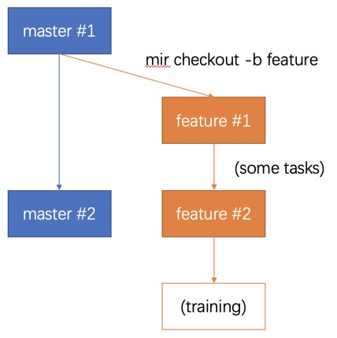

Whenever the user needs to start a new task.
:: The user checks out a new feature branch from within the current master branch, getting the metadata in feature#1 state.
:: The user performs data filtering and other tasks on the metadata of this new branch to obtain the metadata in feature#2 status.
:: When it is confirmed that this metadata is suitable for user's training task, then user can start training using this data.

* At this point, changes made by other users to the master branch's metadata will not affect the training data the user is using either.

**The second scene**: Search for a certain metadata by tag or keyword. The user starts the screening process until the data meets the requirements is obtained, and then the data is used. As shown below:


At this point, whenever a user needs to carry out a new task.
:: You can search for a metadata that basically matches your requirements by means of keywords, tags and so on.
:: On this basis, you need sign out a new branch.
:: You can continue data filtering or cleansing on the new branch to obtain data that actually meet the requirements.
:: Use this data for training.

**The third scene**: Incremental merging. Suppose the user has completed the training task of the model using a certain metadata, and at this point there is an update to the metadata of the repository and the master branch. The user wishes to merge this part of the update into the currently used metadata.


Suppose the user is now in FEATURE#2 and the user needs to do the following:
:: You need switch back to master branch master.
:: You need repeat the task previously done for the incremental part master#2 - master#1 to obtain feature#2+.
:: You need cut back to feature#2 and merge feature#2+ to get feature#3.

### 6.1.2. Branch and Dataset Management

The discussion in this section is based on the following assumptions:
:: The user's data is imported in batches in units of datasets.
:: Each dataset is a separate branch.
:: Changes to and maintenance of each dataset are carried out on this branch.
:: Master branch is always empty.
This management approach is shown in the following figure:


We use the concept of code version control in Git to manage our data and models. We use the concept of branches to create new projects so that different tasks on the same set of images can run in parallel. The additions, retrievals, updates and deletions of datasets and basic operations are created commits to branches. Logically, each commit stores an updated version of the dataset or new model, as well as the metadata of the operation that led to this change. In the end, only the data changes are merged into the main branch, which conceptually aggregates all the data annotated by many projects on the platform.

# 7. MISC

## 7.1. FAQ

**Why did the upload of the local dataset fail?**

Regardless of whether the dataset has a label file, the images folder and annotations folder must be created. The images are placed in the images folder and the format is limited to jpg, jpeg, png. The annotations files are placed in the annotations folder and the format is pascal (when there is no annotations file, the folder is empty). Please put the images and annotations in the same folder and compress them into a .zip compressed package (not a .rar compressed format).

**How should I obtain training and mining configuration files?**

The default profile template needs to be extracted in the mirror.

The training image `industryessentials/executor-det-yolov4-training:release-0.1.2` has a configuration file template located at: `/img-man/training-template.yaml`

Mining and inference mirrors The configuration file templates for `industryessentials/executor-det-yolov4-mining:release-0.1.2` are located at: `/img-man/mining-template.yaml` (mining) and `/img-man/infer-template. yaml` (infer)

**How can the trained model be used outside the system?**

After successful training, the system will output the id of the model, and the user can find the corresponding file according to this id at `--model-location`, which is in fact a tar file that can be extracted directly using the tar command to get the mxnet model file in parameters and json format.

**How to view and modify the label file of the category name?**

This file is in the package installation directory, use this command to view content of this file:

```
cat `pip show ymir-proto | grep 'Location: ' | cut -d ' ' -f2`/ymir/ids/type_id_names.csv
```

And you may get output like this:

```
0,frisbee
1,car
2,person
3,surfboard
4,cat
5,bed
6,clock
7,pizza,pizza pie
8,skateboard
9,dining table,diningtable,board
```

Each line of this configuration file is separated by commas, the first item is type id, followed by type name.

Pay attention to this line with id 7, it has 3 items: 7, pizza and pizza pie. The first one is type id, the second one is type name, and the third one is type alias.

In filter command, -c and -C arguments are mapped to type id with this file, all type alias has the same meaning as type names.

You can edit this file by vi and other text editing tools, you can add and change type alias, add type id and type names, but don’t change ids and names we already have.

## 7.2. License

YMIR is licensed under version 2.0 of the Apache License. See the [LICENSE](https://github.com/IndustryEssentials/ymir/blob/master/LICENSE) file for details.

## 7.3. Contact us

Contact us with further questions：contact.viesc@gmail.com

<!-- ALL-CONTRIBUTORS-BADGE:START - Do not remove or modify this section -->
[](#contributors-)
<!-- ALL-CONTRIBUTORS-BADGE:END -->

<a href="https://github.com/phoenix-xhuang"></a> 
<a href="https://github.com/IJtLJZ8Rm4Yr"></a> 
<a href="https://github.com/elliotmessi"></a> 
<a href="https://github.com/Aryalfrat"></a> 
<a href="https://github.com/fenrir-z"></a> 
<a href="https://github.com/under-chaos"></a> 
<a href="https://github.com/Zhang-SJ930104"></a> 
<a href="https://github.com/LuciferZap"></a> 
