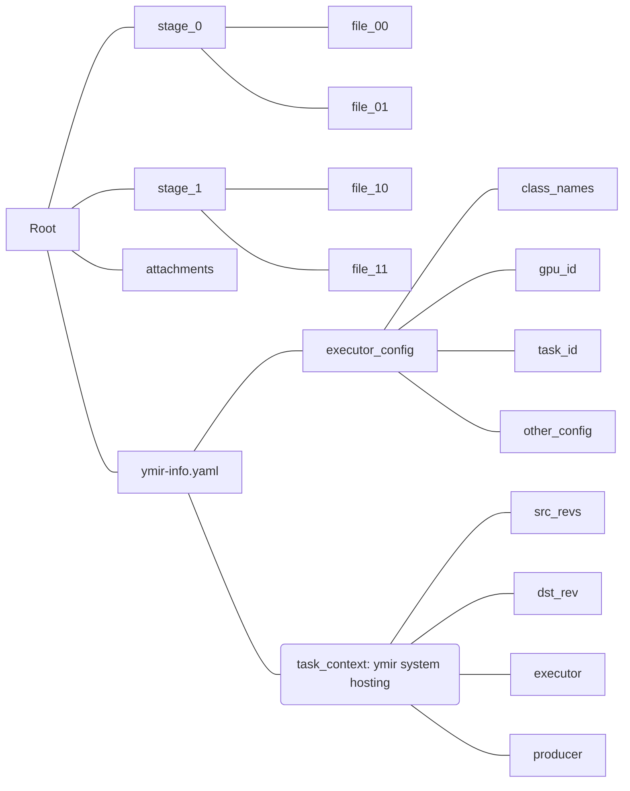

# 模型的结构

训练完成后，系统将镜像生成的所有数据打包，放入 ymir-workplace/ymir-models 目录下，并在命令行中显示以下提示信息：

``` plain
Pack success, model hash: xxx, best stage: xxx
```

其中，model hash 对应的是模型文件的 sha1sum，可以直接在 ymir-workplace/ymir-models/ 下找到对应的文件，这是一个 tar.gz 文件，可以直接解压。

下图展示了这个模型包里面拥有的数据结构：



注1：这个模型包由三部分组成：模型文件，附件以及现场配置

注2：模型文件放在以中间模型名称命名的文件夹下

注3：附件放置在专门的 attachments 文件夹下（如果有的话）

注4：ymir-info.yaml 文件中，executor_config 是训练时镜像所用的配置文件，task_context 是对训练环境的描述，后者由 ymir 系统管理，镜像开发者只需要关注 executor_config 即可
