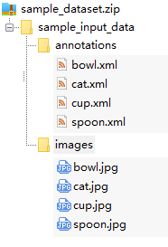
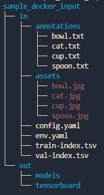

# ymir-web 数据集格式说明

## 外部导入ymir系统

- 参考[外部数据导入](https://github.com/IndustryEssentials/ymir#421-preparation-of-external-data)

- [sample数据集](https://github.com/yzbx/ymir-executor-fork/releases/download/dataset/import_sample_dataset.zip)

    

## ymir系统传入镜像

- 参考[ymir 与功能性 docker container 数据传输接口](https://github.com/IndustryEssentials/ymir/blob/master/docs/ymir-cmd-container.md)

- [sample /in /out](https://github.com/yzbx/ymir-executor-fork/releases/download/dataset/sample_docker_input.zip)

    

### 索引文件 train-index.tsv / val-index.tsv / candidate-index.tsv

- 每行由`图像的绝对路径` + `制表符` + `标注的绝对路径`构成

```
{image_abs_path 1}\t{annotation_abs_path 1}
{image_abs_path 2}\t{annotation_abs_path 2}
...
```

- 图像为常见的`jpg, png, jpeg`等格式
- 标注为`txt`格式，其中`class_id, xmin, ymin, xmax, ymax`均为整数
```
class_id, xmin, ymin, xmax, ymax, 其它信息
```


### 超参数配置文件 config.yaml

- 对于训练任务，提供training-template.yaml中的配置 + ymir-web 用户自定义配置 + ymir默认配置
- 对于挖掘任务，提供mining-template.yaml中的配置 + ymir-web 用户自定义配置 + ymir默认配置
- 对于推理任务，提供infer-template.yaml中的配置 + ymir-web 用户自定义配置 + ymir默认配置

```
class_names: # ymir
- bowl
- cat
- bottle
- cup
- spoon
gpu_id: '0' # ymir
pretrained_model_paths: [] # ymir
task_id: t0000001000002ebb7f11653630774 # ymir
img_size: 640 # user/template
model: yolov5n # user/template
opset: 11 # user/template
batch_size: 16 # user/template
```

### ymir路径配置文件 env.yaml

存放一些路径信息，以及当前进行的任务信息

- 训练任务: `run_training: true`
- 推理任务：`run_infer: true`
- 挖掘任务: `run_mining: true`

```
input:
  annotations_dir: /in/annotations
  assets_dir: /in/assets
  candidate_index_file: ''
  config_file: /in/config.yaml
  models_dir: /in/models
  root_dir: /in
  training_index_file: /in/train-index.tsv
  val_index_file: /in/val-index.tsv
output:
  infer_result_file: /out/infer-result.json
  mining_result_file: /out/result.tsv
  models_dir: /out/models
  monitor_file: /out/monitor.txt
  root_dir: /out
  tensorboard_dir: /out/tensorboard
  training_result_file: /out/models/result.yaml
run_infer: false
run_mining: false
run_training: true
task_id: t0000001000002ebb7f11653630774
```