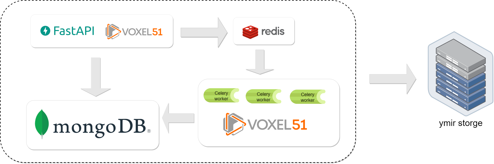

# Ymir FiftyOne Plugin

## Introduction

Ymir FiftyOne Plugin is a plugin for Ymir that provides a simple way to use
the [voxel51/fiftyone](https://github.com/voxel51/fiftyone).

1. FiftyOne docker image provided
   by [IndustryEssentials/fiftyone-ymir](https://github.com/IndustryEssentials/fiftyone-ymir).

2. Ymir share its Dataset to the FiftyOne container by docker volume.

