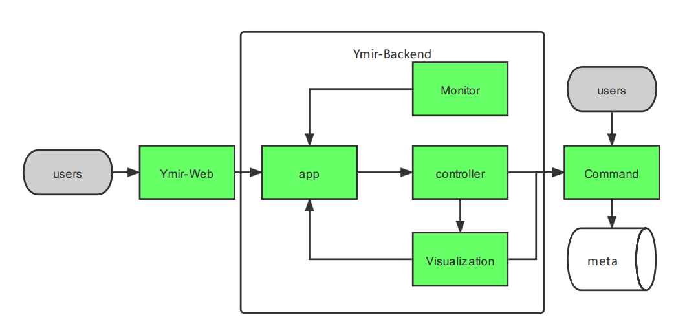

# Ymir-backend

## Overview

Ymir-backend is one of three components within the Ymir project:

1. [Ymir-Web](https://github.com/IndustryEssentials/ymir/tree/master/ymir/web), a web UI application that renders dashboards
2. Ymir-Backend, dispatch the task to Ymir-cmd, get task information
3. [Ymir-cmd](https://github.com/IndustryEssentials/ymir/tree/master/ymir/command), the CLI of Ymir, it manages annotations (metadata) and image assets (media files) separately



Ymir-Backend is responsible for receiving task from Web, maintaining the relationships between user and tasks, dispatching planned tasks to Ymir-cmd where the tasks are executed

## Up and running

Run tests with `tox`:

```bash
tox
```

Bring up by docker-compose:

```bash
docker-compose -f docker-compose.dev.yml up --build -d
```

Further reading: [Ymir](https://github.com/IndustryEssentials/ymir)


## License

Ymir is licensed under version 2.0 of the Apache License. See the [LICENSE](https://github.com/IndustryEssentials/ymir/blob/master/ymir/backend/LICENSE) file for details.


<!-- ALL-CONTRIBUTORS-BADGE:START - Do not remove or modify this section -->
[](#contributors-)
<!-- ALL-CONTRIBUTORS-BADGE:END -->
